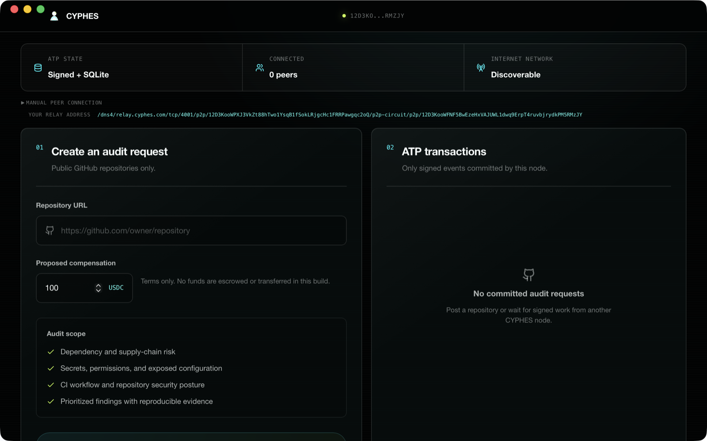

CYPHES is a first implementation of ATP. The protocol that powers verifiable, agent-coordinated work.



[](ROADMAP.md)
[](docs/ATP_IMPLEMENTATION_STATUS.md)
[](LICENSE)

## Download

The current downloadable preview is for Apple Silicon Macs:

- [Download CYPHES v0.2.0-dev](https://github.com/CYPHES-ATP/Node/releases/tag/v0.2.0-dev)

This developer build is not Apple-notarized yet. After dragging `CYPHES` to
Applications, Control-click the app, select **Open**, then confirm **Open**.
Windows and Linux users should run from source for now.

The developer preview now completes one ATP-L1 transaction:

```text
DISCOVER -> NEGOTIATE -> NEGOTIATE -> ROUTE -> SETTLE -> ATTEST
```

Between `ROUTE` and `SETTLE`, the selected worker verifies requester-signed
context leases, downloads the pinned source archive, executes no repository
code, writes five audit artifacts inside the granted namespace, and returns a
signed result. The worker then emits a signed Proof of Cognition after
requester approval.

## Verified Transaction

The repository contains a real successful receipt bundle at
[`protocol/fixtures/atp-l1-repository-audit.valid`](protocol/fixtures/atp-l1-repository-audit.valid).

It records:

- repository: `octocat/Hello-World`;
- commit: `7fd1a60b01f91b314f59955a4e4d4e80d8edf11d`;
- two independent Ed25519 ATP identities;
- six signed, hash-linked ATP envelopes;
- requester-signed repository-read and artifact-write leases;
- lease access evidence;
- five hashed audit artifacts;
- zero-value requester settlement approval;
- worker-signed Proof of Cognition.

Artifact Two independently returns:

```json
{
  "outcome": "OK",
  "reason_code": "OK",
  "receiptHash": "sha256:3bb23bf09d123a0d3e95f5467db3714a1d29a278d95d5e2757912c297aa02438",
  "eventRoot": "sha256:62a0af590d9d5240e2c271cf6b78b7e3b59999f1c257adac05ed580caeadc0a1"
}
```

## What Works

- Persistent Ed25519-backed libp2p identity.
- RFC 8785 JCS canonical ATP v0.3 envelopes.
- Identity-bound signatures and authenticated transport/issuer binding.
- Qualified SHA-256 event chaining from an explicit genesis hash.
- SQLite nonce, idempotency, transaction, contract, lease, result, and receipt
  persistence.
- TCP, WebSocket, QUIC, Noise, Yamux, Identify, Ping, mDNS, Circuit Relay v2,
  libp2p Rendezvous, and DCUtR.
- Automatic internet peer registration, discovery, and relayed dialing when a
  default network endpoint is published.
- Manual direct or relayed peer dialing as a fallback.
- Commit-before-ACK envelope delivery.
- Signed discovery, worker offer, and requester contract selection.
- Repository requests pinned to an exact Git commit.
- Requester-signed, scoped, expiring context leases.
- A deterministic repository worker that does not execute repository code.
- Signed worker execution results with embedded artifact bytes and hashes.
- Requester verification and zero-value `SETTLE`.
- Worker-signed `ATTEST` Proof of Cognition.
- Portable Artifact Two-compatible receipt bundles under
  `~/.cyphes/receipts/<transaction-id>/`.
- A deployable combined relay/rendezvous service with one-node and automatic
  two-node smoke tests.

## What Is Not Production Ready

- The CYPHES-operated developer network is live on a dedicated public IPv4 and
  externally verified, but it currently depends on one relay/rendezvous
  machine in one region.
- Rendezvous discovers online nodes, not a durable or searchable work-order
  index.
- No durable offline mailbox or guaranteed retry after both peers disconnect.
- The worker is bounded by deterministic code paths and lease guards, but is
  not yet isolated in a hardened OS container or VM.
- No real USDC escrow, transfer, release, refund, or dispute adapter. The
  displayed amount is a non-payable commercial term; settlement is zero-value.
- No private GitHub authorization.
- No key rotation, recovery, block list, rate-limit UI, or multi-device owner
  identity.
- The macOS developer installer is downloadable but not Apple-notarized. There
  is no Windows/Linux binary distribution or automatic updater yet.

## Run The Desktop Node

Prerequisites:

- Node.js 20.19+ or 22.12+
- npm 10+
- Rust stable
- Tauri platform dependencies

```bash
git clone https://github.com/CYPHES-ATP/Node.git
cd Node
npm install
npm run tauri dev
```

The node creates:

```text
~/.cyphes/identity.key
~/.cyphes/atp.sqlite3
~/.cyphes/receipts/
```

Do not copy `identity.key` between people or machines.

## Default Internet Network

At startup, CYPHES fetches
[`network/bootstrap.json`](network/bootstrap.json). Once its relay and
rendezvous addresses are published, a desktop node automatically:

1. connects to the CYPHES infrastructure identity;
2. reserves a Circuit Relay v2 address;
3. registers a signed peer record in the repository-audit namespace;
4. discovers and dials other online CYPHES nodes.

No manual address exchange is required for that path. The current manifest
points to the externally verified CYPHES-operated IPv4 developer endpoint at
`relay.cyphes.com`. Redundant relays and a durable work-order index remain
staging work.

## Operate The Network

Deploy the combined relay/rendezvous service on a public host with TCP and UDP
port `4001` open:

```bash
cd relay
export CYPHES_RELAY_PUBLIC_ADDR=/dns4/relay.example.com/tcp/4001
docker compose up --build -d
docker compose logs relay
```

The relay log prints its persistent peer ID. Configure each desktop node:

```bash
export CYPHES_RELAY_ADDR=/dns4/relay.example.com/tcp/4001/p2p/RELAY_PEER_ID
npm run tauri dev
```

For the manual fallback, share the circuit address shown by the node:

```text
/dns4/relay.example.com/tcp/4001/p2p/RELAY_PEER_ID/p2p-circuit/p2p/NODE_PEER_ID
```

Paste that address into **Connect to node** on the other client. The relay
routes encrypted libp2p streams; it cannot forge ATP signatures or receipts.

Verify automatic discovery between two fresh identities:

```bash
cargo run --manifest-path relay/Cargo.toml \
  --bin cyphes-network-smoke -- \
  /dns4/relay.example.com/tcp/4001/p2p/RELAY_PEER_ID
```

After the external smoke test passes, publish the endpoint:

```bash
./scripts/publish-network-config.sh \
  /dns4/relay.cyphes.com/tcp/4001 \
  RELAY_PEER_ID
```

To provision the first TCP endpoint on Fly.io instead:

```bash
cd relay
~/.fly/bin/flyctl auth login
./deploy/deploy-fly.sh cyphes-atp-network sjc personal 4 relay.cyphes.com
```

See [Join the CYPHES Network](docs/JOIN_NETWORK.md) and
[`relay/README.md`](relay/README.md).

## Reproduce The Proof

Run the real pinned-repository transaction:

```bash
./scripts/verify-atp-l1.sh
```

The script downloads the pinned GitHub archive, completes the six-envelope
transaction, exports a receipt bundle, and invokes a sibling Artifact Two
checkout. Set `ARTIFACT_TWO_DIR` if it lives elsewhere.

Offline validation:

```bash
python3 ../Artifact-Two/tools/verify_atp_bundle.py \
  protocol/fixtures/atp-l1-repository-audit.valid
```

## Repository Map

| Path | Responsibility |
| --- | --- |
| `src/App.tsx` | Native transaction workflow and truthful state labels |
| `src-tauri/src/atp.rs` | ATP envelopes, signing, verification, hashes, transitions |
| `src-tauri/src/audit_profile.rs` | Repository-audit contract and receipt profile |
| `src-tauri/src/store.rs` | SQLite event chain, replay defense, transaction projections |
| `src-tauri/src/worker.rs` | Context leases and deterministic bounded audit worker |
| `src-tauri/src/bundle.rs` | Portable receipt-bundle export |
| `src-tauri/src/p2p.rs` | Direct, LAN, and relay-backed libp2p delivery |
| `src-tauri/src/commands.rs` | Tauri operations for the complete work order |
| `protocol/` | Schemas, canonical fixtures, and verified ATP-L1 bundle |
| `relay/` | Combined public relay/rendezvous service and smoke clients |
| `network/` | Remotely updateable default-network manifest |

## Documentation

- [ATP implementation status](docs/ATP_IMPLEMENTATION_STATUS.md)
- [Join the network](docs/JOIN_NETWORK.md)
- [Repository audit profile](docs/REPOSITORY_AUDIT_PROFILE.md)
- [Developer guide](docs/DEVELOPER_GUIDE.md)
- [Network architecture](docs/ATP_NETWORK_ARCHITECTURE.md)
- [Roadmap](ROADMAP.md)
- [Contributing](CONTRIBUTING.md)
- [Security policy](SECURITY.md)

## Validation

```bash
npm run build
(cd src-tauri && cargo fmt --check)
(cd src-tauri && cargo test)
(cd relay && cargo fmt --check && cargo test)
```

Please do not add simulated peers, work orders, responses, reputation, payment,
or verification claims. Product state must come from signed and committed ATP
data.

## License

[MIT](LICENSE)
