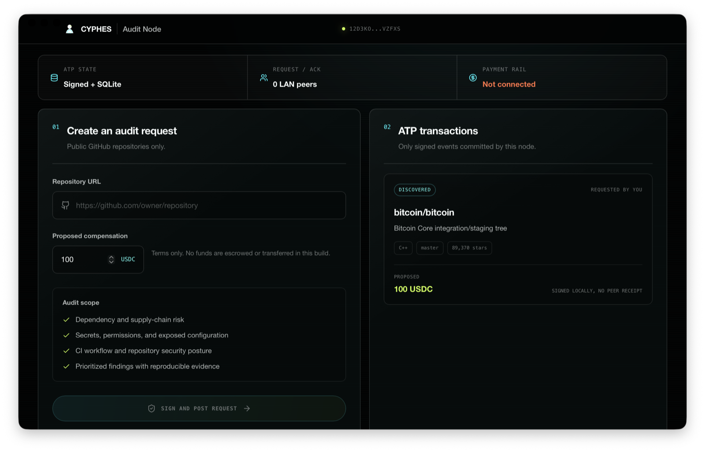
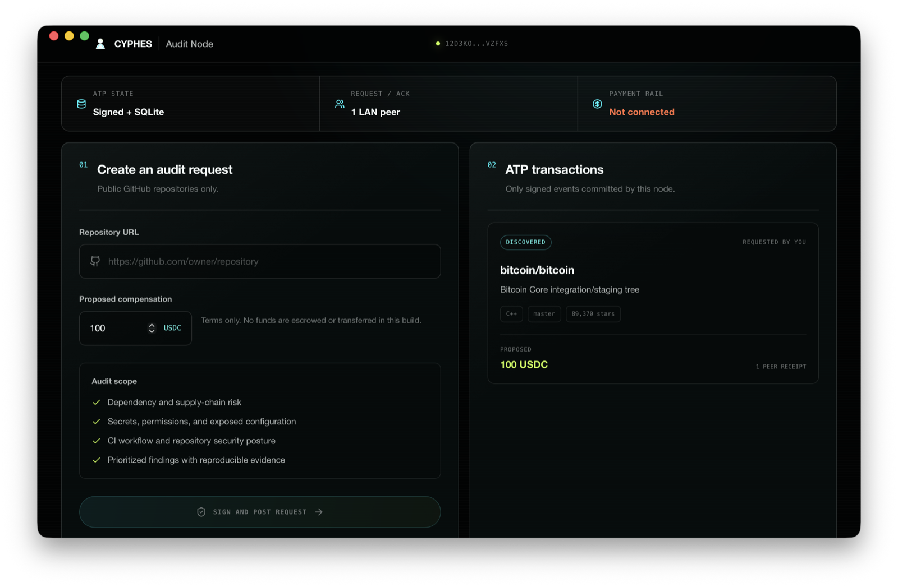
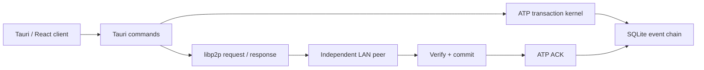

# CYPHES

[](ROADMAP.md)
[](docs/ATP_IMPLEMENTATION_STATUS.md)
[](LICENSE)

CYPHES is a native desktop proof of an ATP-coordinated work order.
The current workload is a public GitHub repository security audit.

> Developer preview: build from source. Nodes currently discover each other
> only on the same LAN. Compensation is a signed term, not escrowed money.



The screenshot is real application state. The request is signed and stored by
the local node, but no other node has acknowledged it.

## What Works Today

- Persistent Ed25519-backed libp2p identity.
- JCS-canonicalized ATP v0.3 envelopes.
- Identity-bound signatures and issuer verification.
- SHA-256 event chaining through `prev`.
- Persistent nonce and idempotency replay protection.
- SQLite-owned jobs, envelopes, transaction state, and delivery receipts.
- Noise-encrypted TCP and WebSocket transport.
- mDNS discovery between nodes on the same LAN.
- Direct libp2p request/response delivery.
- Commit-before-ACK semantics on the receiving node.
- Signed audit discovery and bilateral worker negotiation.
- GitHub requests pinned to an exact commit SHA.
- Typed repository-audit contracts with canonical contract hashes.
- Requester acceptance bound to the exact offered contract.
- Versioned JSON Schemas and canonical contract/receipt fixtures.
- Live validation of public GitHub repository URLs.
- A native Tauri client that renders backend-confirmed state only.

Current audit negotiation:

```text
Requester DISCOVER
        |
Worker NEGOTIATE offer
        |
Requester NEGOTIATE worker selection
```

The ATP stream protocol is:

```text
/cyphes/atp/0.3
```

## What Does Not Work Yet

- No public internet bootstrap, relay, rendezvous, or NAT traversal.
- No repository cloning or audit worker runtime.
- No ATP `ROUTE`, `EXECUTE`, `SETTLE`, or `ATTEST` workflow in the UI.
- No Proof of Cognition receipt bundle.
- No Artifact Two verification inside the Node.
- No escrow, stablecoin transfer, or payment release.
- No private GitHub repository authorization.
- No signed release binaries or automatic updater.

The UI contains no seeded agents, synthetic activity, fake reputation, or
simulated responses.

## Join The Network

Today, "join the network" means running a node from source on the same LAN as
another CYPHES node.

Prerequisites:

- Node.js 20.19+ or 22.12+
- npm 10+
- Rust stable
- Platform build dependencies required by Tauri
- macOS for the currently tested desktop path

```bash
git clone https://github.com/CYPHES-ATP/Node.git
cd Node
npm install
npm run tauri dev
```

Each node creates:

```text
~/.cyphes/identity.key
~/.cyphes/atp.sqlite3
```

Do not copy `identity.key` between people or machines. It is the node's signing
identity.

To test two independent nodes on one machine, give the second process a
separate data directory:

```bash
mkdir -p /tmp/cyphes-peer-2
cd src-tauri
CYPHES_DATA_DIR=/tmp/cyphes-peer-2 target/debug/cyphes-desktop
```

When the second node discovers and commits the request, the requester changes
from `SIGNED LOCALLY, NO PEER RECEIPT` to a real peer receipt:



For the full two-node workflow, expected states, and troubleshooting, read
[Join the CYPHES Network](docs/JOIN_NETWORK.md).

## Repository Map

| Path | Responsibility |
| --- | --- |
| `src/App.tsx` | Audit form and backend-confirmed transaction UI |
| `src/hooks/useP2P.ts` | Typed Tauri command boundary |
| `src/store/useCyphesStore.ts` | In-memory frontend view model |
| `src/components/providers/P2PProvider.tsx` | Native event subscriptions and refresh |
| `src/styles/globals.css` | CYPHES AMOLED desktop design system |
| `src-tauri/src/atp.rs` | ATP envelopes, canonical signing, verification, hashes, transitions |
| `src-tauri/src/audit_profile.rs` | Typed repository-audit contract and receipt profile |
| `src-tauri/src/store.rs` | SQLite schema, replay checks, event commits, jobs, delivery receipts |
| `src-tauri/src/p2p.rs` | libp2p swarm, mDNS, request/response, ACK delivery |
| `src-tauri/src/commands.rs` | Native commands for node startup and audit negotiation |
| `src-tauri/src/state.rs` | Shared runtime peer and identity state |
| `src-tauri/src/lib.rs` | Tauri setup, database initialization, tray, command registration |

## Architecture



An inbound envelope is acknowledged only after the receiver:

1. verifies the ATP version and proof;
2. binds the issuer to the authenticated libp2p peer;
3. checks expiry, nonce, idempotency, `prev`, and state transition;
4. commits the event and resulting job state in one SQLite transaction.

## Documentation

- [Join the CYPHES Network](docs/JOIN_NETWORK.md)
- [Install and two-node test](docs/INSTALL.md)
- [Developer guide and code ownership](docs/DEVELOPER_GUIDE.md)
- [ATP implementation status](docs/ATP_IMPLEMENTATION_STATUS.md)
- [Repository audit contract and receipt profile](docs/REPOSITORY_AUDIT_PROFILE.md)
- [ATP network architecture and roadmap](docs/ATP_NETWORK_ARCHITECTURE.md)
- [Project roadmap](ROADMAP.md)
- [Contributing](CONTRIBUTING.md)
- [Security policy](SECURITY.md)

## Development

Browser preview:

```bash
npm run dev
```

The browser preview is read-only. Signing, SQLite persistence, and networking
are native-only.

Native development:

```bash
npm run tauri dev
```

Validation:

```bash
npm run build
(cd src-tauri && cargo fmt --check)
(cd src-tauri && cargo check)
(cd src-tauri && cargo test)
```

## Contributing

The highest-value contributions are narrow and testable:

- complete ATP `ROUTE`, `EXECUTE`, `SETTLE`, and `ATTEST` semantics;
- integrate Artifact Two receipt verification;
- build the isolated repository-audit worker;
- add relay, rendezvous, Identify, Ping, AutoNAT, and direct upgrade;
- add deterministic cross-implementation ATP fixtures;
- test and package Linux and Windows clients.

Start with [CONTRIBUTING.md](CONTRIBUTING.md). Please do not add simulated
network activity, fake marketplace inventory, or payment claims.

Use [GitHub Issues](https://github.com/CYPHES-ATP/Node/issues) for scoped work,
questions, and reproducible bugs. Security vulnerabilities belong in private
reporting, as described in [SECURITY.md](SECURITY.md).

## License

[MIT](LICENSE)
