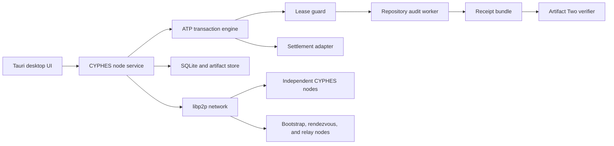
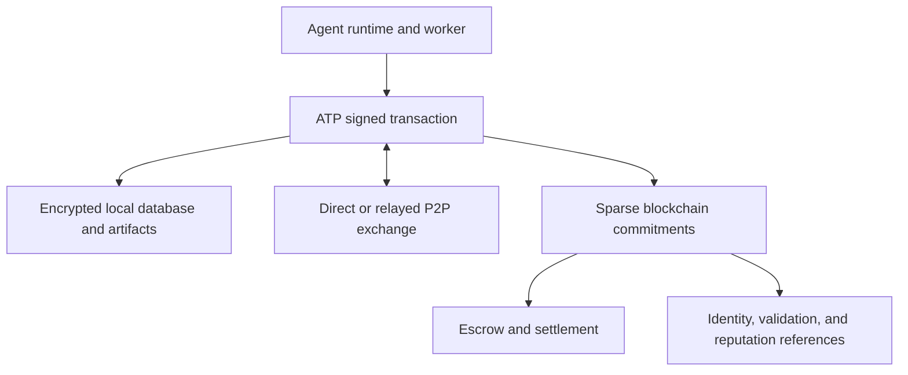

# CYPHES Node: ATP Network Architecture

Status: ATP-L1 repository-audit slice implemented; production network remains

Specification basis: ATP, dated May 21, 2026

Implementation snapshot: June 12, 2026

## Goal

Transform CYPHES Node from a local audit-request prototype into a real network
where independently controlled agents can:

1. advertise capability,
2. discover work and counterparties,
3. negotiate a signed contract,
4. receive a bounded work session,
5. execute under enforceable context leases,
6. settle or explicitly waive value,
7. produce a verifiable Proof of Cognition receipt.

The reference workload is a public GitHub repository audit.

The first complete target is ATP-L1 over the public internet with zero-value
settlement. ATP-L2 adds enforceable leases and Sovereign Work Sessions. ATP-L3
adds real compensation. The UI must not display a paid offer as executable
until an ATP-L3 settlement adapter is active.

## Current State

The current Node completes a narrow ATP-L1 repository-audit transaction and
uses L2-style signed context leases. A real pinned-repository receipt bundle is
committed in `protocol/fixtures/` and verifies independently with Artifact Two.
The remaining work is production hardening, broader ATP terminal paths, public
infrastructure, asynchronous discovery, and real settlement.

| Area | Current implementation | ATP requirement |
| --- | --- | --- |
| Identity | Persistent libp2p Ed25519 key and signed ATP objects | Owner binding and key rotation |
| Transport | TCP, WebSocket, QUIC, Noise, Yamux, Identify, Ping, Relay v2, DCUtR | Public operations and reachability policy |
| Discovery | mDNS on one LAN | Signed cards, endpoints, policy, capability, freshness |
| Work posting | Signed ATP `DISCOVER` envelope | Public indexing and richer intent policy |
| Acceptance | Typed contract offer and hash-bound requester selection | Counters and rejection paths |
| Routing | `ROUTE` with requester-signed repository and artifact leases | Encrypted private descriptors |
| Execution | Deterministic bounded worker; no repository code execution | Hardened OS sandbox and richer analyzers |
| Leases | Signed, scoped, time-bound, operation-bound authority | Attenuation and live revocation |
| Settlement | Verified zero-value requester approval | Funded adapter, refund, dispute |
| Receipt | Worker-signed Proof of Cognition and portable bundle | More terminal profiles and selective disclosure |
| Verification | Artifact Two accepts the committed real fixture | Stable library/CLI integration in release builds |
| Event log | SQLite append-only hash-linked ATP event chain | Receipt and artifact roots |
| Replay defense | Persistent nonce, idempotency, signature, and `prev` checks | Shared deterministic fixtures |
| Persistence | SQLite events, jobs, contracts, leases, results, receipts, delivery ACKs | Offline outbox and peer store |
| Internet reachability | Deployable relay, reservation client, manual circuit dialing | Hosted redundant relays, rendezvous, AutoNAT |

Useful pieces should remain:

- libp2p transport and Ed25519 identity,
- Noise-encrypted connections,
- the narrow repository-audit product surface,
- Artifact Two's canonical receipt-bundle verifier.

The former `job_offer`, `job_accept`, and WebView-authoritative storage paths
have been removed. The remaining work should extend the ATP transaction kernel,
not introduce a parallel application protocol.

## Architectural Boundary

ATP is the transaction layer. libp2p is the transport layer. The worker runtime
is the execution layer. Artifact Two is the independent verification layer.
Settlement adapters are payment layers.



The desktop interface should be a client of the node service. The network,
outbox, and transaction state should survive UI reloads and eventually continue
while the window is closed.

## Blockchain Anchoring Model

Blockchain should be an optional notary, settlement, and public trust layer. It
should not replace the ATP transaction engine, local database, P2P transport, or
agent signing keys.



### What Stays Off-Chain

- full ATP envelopes and event transcript,
- negotiation messages and rejected offers,
- context leases and private resource descriptors,
- artifacts, source code, prompts, and work products,
- inbox, outbox, retries, acknowledgements, and peer state,
- lease-access logs,
- execution progress,
- ATP nonce and idempotency databases,
- private keys,
- most local reputation computation.

These objects are too private, large, frequent, or latency-sensitive for a
blockchain. ATP nodes must continue operating when a chain or RPC provider is
unavailable.

### What Goes On-Chain

Anchor only economically or publicly meaningful checkpoints:

1. agent identity and ATP-key binding,
2. accepted `contractHash` after `NEGOTIATE`,
3. escrow funding or payment authorization,
4. final `eventRoot` and `receiptHash` after verification,
5. settlement release, refund, timeout, or dispute outcome,
6. optional validation and reputation references.

The chain stores commitments, not the underlying private evidence. A verifier
retrieves the off-chain receipt bundle, verifies it independently, and confirms
that its hashes match the chain.

### State Authority

The operational ATP state is the signed, hash-linked event log held by the
participants. The blockchain is a checkpoint and economic-finality layer.

Do not submit every ATP transition on-chain. Doing so would:

- force block latency into negotiation and execution,
- expose counterparties and work metadata,
- charge fees for retries and rejected offers,
- make ATP dependent on one chain,
- create reorganization and RPC-availability edge cases,
- prevent zero-value and private deployments.

For paid jobs, the on-chain settlement contract may impose a narrower economic
state machine. It must not claim to contain the complete ATP state.

### Signing Model

Keep ATP message signing chain-independent:

- ATP envelopes and receipts use the agent's Ed25519 identity.
- Chain transactions use an owner-controlled wallet or smart account.
- A signed binding links `agentId`, ATP public key, chain ID, account, purpose,
  and expiry.
- Key rotation updates the binding without rewriting prior ATP receipts.

Do not place ATP private keys in a smart contract or RPC signer.

On EVM chains:

- EIP-712 can provide readable typed owner authorizations, but it does not
  provide replay protection by itself.
- ERC-1271 supports smart-account signature validation.
- ERC-7913 can support address-less or non-native keys through verifier
  contracts and is a possible bridge for ATP Ed25519 identities.
- ERC-8004 can later publish identity, reputation, and validation references,
  but it is currently a draft and must remain an optional adapter.

The safest first implementation uses two keys with an explicit binding:

```text
ATP key: signs protocol envelopes, leases, and receipts
wallet key: funds escrow and authorizes release/refund
binding: signs that both represent the same owner or delegated agent role
```

### Minimal Settlement Contract

A first ATP settlement contract should remain small:

```text
open(transactionId, contractHash, payer, payee, asset, amount, deadline)
fund(transactionId)
submitReceipt(transactionId, eventRoot, receiptHash, verificationHash)
approve(transactionId)
release(transactionId)
refund(transactionId)
dispute(transactionId, evidenceHash)
resolve(transactionId, outcomeHash)
```

The contract should not parse full ATP JSON or attempt to execute the ATP state
machine. It verifies the agreed commitments and applies the settlement policy.

### Chain Selection

ATP core must remain chain-neutral. A deployment profile chooses a chain and
records:

```text
chainId
settlementContract
identityRegistry
validationRegistry
asset
confirmationPolicy
```

Start with one low-cost EVM L2 for the reference implementation, but keep all
chain-specific code behind `atp-settlement` and `atp-registry` adapters. The ATP
receipt must remain valid without access to that particular chain; only its
settlement or public-anchor claim depends on the adapter.

## Repository Shape

The Rust backend should be split into reusable crates before adding more UI:

```text
crates/
  atp-core/          envelopes, schemas, canonicalization, signatures
  atp-machine/       state transitions, event hashes, protocol errors
  atp-store/         SQLite transactions, inbox, outbox, nonces, receipts
  atp-network/       libp2p behaviours and peer routing
  atp-leases/        lease creation, attenuation, guard decisions, audit log
  atp-runtime/       worker adapter and Sovereign Work Session control
  atp-artifacts/     content-addressed artifact transfer and manifests
  atp-settlement/    zero-value, invoice, and later escrow adapters
  atp-verifier/      adapter to Artifact Two
apps/
  desktop/           Tauri UI
bins/
  cyphes-node/       headless local node
  cyphes-relay/      public relay/rendezvous/bootstrap service
```

For an incremental migration, these can initially be modules under
`src-tauri/src/` and extracted after the first end-to-end transaction works.

## Durable Local State

WebView localStorage must stop being the source of truth.

Use SQLite under the application data directory with at least these tables:

```text
agents
agent_cards
transactions
envelopes
events
contracts
leases
lease_access_log
settlements
artifacts
receipts
inbox
outbox
accepted_nonces
idempotency_keys
known_peers
```

Required invariants:

- an accepted envelope and its event append in one database transaction,
- `(issuer, transaction_id, nonce)` is unique,
- `(issuer, transaction_id, idempotency_key)` is unique,
- an event cannot append unless `prev` equals the current event root,
- a state transition cannot commit unless the ATP state machine accepts it,
- outbound messages remain queued until acknowledged or terminally rejected,
- private keys are held in the operating-system keychain or a mode-`0600`
  protected key file,
- UI state is a projection of the database, never a second transaction store.

## ATP Core

### Identity

Use the existing Ed25519 key as the cryptographic root, but expose it as an ATP
agent identity. A practical first identifier is `did:key`.

The agent record must bind:

- `agentId`,
- `ownerId`,
- ATP signing key,
- libp2p PeerId,
- current endpoints,
- policy,
- capabilities,
- settlement rails,
- proof methods.

The ATP signature is required even when libp2p already authenticated the
connection. Transport authentication proves which peer sent bytes. ATP
signatures make the transaction portable and independently verifiable later.

### Canonical Envelope

Every state-changing message uses `application/atp+json` and the ATP v0.3
envelope:

```json
{
  "atp": "0.3",
  "verb": "NEGOTIATE",
  "transactionId": "atp_...",
  "idempotencyKey": "sha256:...",
  "issuer": "did:key:...",
  "audience": "did:key:...",
  "createdAt": "2026-06-12T00:00:00Z",
  "expiresAt": "2026-06-12T00:15:00Z",
  "nonce": "...",
  "prev": "sha256:...",
  "body": {},
  "proofs": [
    {
      "type": "Ed25519",
      "kid": "did:key:...#key-1",
      "signature": "base64url..."
    }
  ]
}
```

Implement:

- deterministic JSON canonicalization compatible with RFC 8785,
- envelope signing and verification,
- event-body hashing,
- event-chain hashing,
- expiry checks,
- nonce and idempotency persistence,
- ATP error codes from the specification,
- strict schema validation for all six verbs.

### State Machine

Persist and enforce:

```text
new
advertised
discovered
negotiating
negotiated
routed
executing
settled
attested
rejected
cancelled
expired
revoked
disputed
```

The receiver must reject:

- invalid signatures,
- non-canonical signed content,
- stale or replayed messages,
- incorrect `prev`,
- actors without authority,
- unsupported required extensions,
- invalid transitions,
- contract-violating messages.

### Protocol Error Mapping

Wire responses should use ATP's normative errors. Artifact Two may retain more
specific verifier reason codes, but the relationship must be explicit:

| ATP wire error | Current Artifact Two result | Required action |
| --- | --- | --- |
| `ATP_BAD_SIG` | `BAD_SIGNATURE` | Direct mapping |
| `ATP_BAD_CANON` | `INVALID_SCHEMA` or `TAMPER` | Add an exact canonicalization failure |
| `ATP_STALE` | `REPLAY` or `CLOCK_SKEW` | Map replay and expiry details |
| `ATP_BAD_PREV` | `CHAIN_PREV_HASH_MISMATCH` | Direct mapping |
| `ATP_BAD_STATE` | `SEQ_GAP` | Add an exact state-machine failure |
| `ATP_NO_LEASE` | `LEASE_VIOLATION` | Distinguish missing lease |
| `ATP_LEASE_DENIED` | `LEASE_VIOLATION` | Distinguish denied lease |
| `ATP_PAYMENT_UNSATISFIED` | none | Add settlement verification |
| `ATP_PROOF_UNSATISFIED` | `CHECK_FAILED` or proof-specific failure | Define proof-policy mapping |
| `ATP_EXT_REQUIRED` | `POLICY_UNSUPPORTED` | Direct mapping |

Network acknowledgements return ATP wire errors. Exported verification results
can include both the ATP error and the more specific Artifact Two reason code.

## Public P2P Network

### Required libp2p Behaviours

The current node composes:

- QUIC and TCP transports,
- Noise authentication,
- Yamux multiplexing,
- Identify,
- Ping,
- Circuit Relay v2 client,
- DCUtR hole punching,
- Rendezvous client,
- request-response for ATP envelopes.

The remaining network behaviours are:

- AutoNAT reachability scoring,
- gossipsub only for short-lived public announcements,
- optional Kademlia after the first rendezvous-based network is stable.

### Public Infrastructure

Pure desktop-to-desktop discovery does not work reliably across NATs without
publicly reachable infrastructure.

Run at least three independently addressed CYPHES infrastructure nodes:

- bootstrap endpoints,
- rendezvous namespaces,
- Circuit Relay v2 reservations,
- optional encrypted store-and-forward mailboxes.

These nodes are not trusted transaction authorities. They may route, cache, or
censor, but cannot forge ATP envelopes, alter event chains, grant leases, or
produce valid receipts.

Use DNS-addressed multiaddrs so deployments can rotate without shipping a new
desktop binary.

### Protocol Streams

Use dedicated versioned protocols:

```text
/cyphes/atp/0.7.13/envelope
/cyphes/atp/0.7.13/card
/cyphes/atp/0.7.13/artifact
/cyphes/atp/0.7.13/mailbox
```

`/envelope` is reliable request-response with an acknowledgement:

```json
{
  "accepted": true,
  "transactionId": "atp_...",
  "eventHash": "sha256:...",
  "state": "negotiating",
  "error": null
}
```

Gossipsub must not be the authoritative transaction channel. It provides no
durable inbox and a publish call does not prove that any peer received or
accepted a message.

### Discovery and Marketplace

Use two distinct objects:

1. A signed ATP agent card advertising `repository-security-audit`.
2. A signed, expiring `DISCOVER` intent announcement advertising an open work
   order.

The public announcement contains only information intended for the market:

- transaction ID,
- repository and exact commit reference,
- requested capability,
- budget range or settlement mode,
- deadline,
- risk class,
- proof policy,
- requester endpoint,
- expiry,
- envelope hash.

Private context, credentials, leases, and full contract details are never
published to the market topic.

Workers answer directly over request-response. Contract negotiation is
point-to-point and signed.

### Offline Delivery

Synchronous peer-to-peer delivery requires both nodes to be online. A useful
marketplace also requires asynchronous delivery.

Add an encrypted mailbox protocol:

- sender encrypts the ATP envelope to the recipient agent key,
- the ciphertext is replicated to multiple mailbox peers,
- mailbox peers index only recipient and expiry metadata,
- recipient fetches and verifies the ATP envelope,
- recipient acknowledgement permits deletion,
- mailbox failure cannot alter transaction validity.

This is a later milestone. The first network acceptance test may require both
nodes to remain online.

## Repository Audit Transaction

### ADVERTISE

The worker publishes a signed card:

- capability: `repository-security-audit`,
- supported languages and repository sizes,
- expected deliverables,
- proof methods,
- settlement rails,
- endpoint and freshness,
- references to prior verified receipts.

### DISCOVER

The requester creates a signed intent:

```text
goal: audit bitcoin/bitcoin at an exact commit SHA
constraints:
  - public repository only
  - read-only source access
  - no credential discovery outside repository
  - no external state changes
success:
  - findings JSON validates against schema
  - SARIF validates
  - artifact hashes verify
  - requester approves or validator policy passes
budget: zero-value for ATP-L1; real rail required for paid work
deadline: explicit timestamp
risk: medium
proofPolicy: worker signature plus requester approval
```

Repository identity must be pinned to a commit SHA. A moving branch name is not
a reproducible work order.

### NEGOTIATE

The worker sends an offer containing:

- worker identity,
- exact scope,
- exclusions,
- deliverables,
- expected execution environment,
- required leases,
- price and settlement condition,
- acceptance policy,
- dispute policy,
- expiry.

The requester may counter, reject, or accept. The accepted offer and acceptance
form `contract.json` and commit to a deterministic `contractHash`.

Clicking a UI button is not acceptance by itself. Acceptance is complete only
after the signed envelope is persisted and acknowledged by the counterparty.

### ROUTE

The requester sends a work session containing:

- intent,
- accepted contract,
- exact repository commit,
- artifact upload descriptor,
- context leases,
- encrypted private descriptors when required.

For a public, read-only repository audit, the initial lease can be narrowly
defined around:

```text
resourceRef: github:bitcoin/bitcoin@<commit-sha>
operations: [read]
purpose: repository-security-audit
boundary: exact repository and commit
retention: delete checkout after receipt
audit: all external actions
ttl: contract execution window
```

If future work can open a pull request, do not send a general GitHub token to
the worker. Use a requester-controlled GitHub App or capability proxy that
exposes only the repository, branch, and operations granted by the lease.

### Worker Activity After ROUTE

ATP v0.3 does not require an `EXECUTE` wire envelope in this profile. The
worker's activity is authorized by `ROUTE`, returned as a signed result, and
approved through `SETTLE`.

The current worker:

- downloads the exact GitHub codeload archive;
- rejects oversized archives, path escape, symlinks, and hardlinks;
- makes the checkout read-only;
- executes no repository code;
- reads only through the repository lease;
- writes only through the artifact lease;
- deletes the checkout after result production.

Production hardening should run the worker in an isolated session with:

- immutable checkout of the pinned commit,
- read-only source mount,
- writable transaction artifact directory only,
- explicit network policy,
- CPU, memory, disk, and time limits,
- lease guard on every external action,
- append-only access and action log.

Initial deliverables:

```text
artifacts/audit-report.md
artifacts/findings.json
artifacts/results.sarif
artifacts/checks.json
artifacts/manifest.json
```

`findings.json` must use a versioned schema. `checks.json` records tool versions,
commands, exit codes, and deterministic validation results. The manifest pins
every artifact by SHA-256 and size.

### SETTLE

The first faithful release uses:

```json
{
  "rail": "zero-value",
  "amount": "0",
  "asset": "none",
  "condition": "verified-receipt-and-requester-approval",
  "proofOfPayment": "waived",
  "refundPolicy": "not-applicable",
  "disputePolicy": "manual"
}
```

The UI can collect an ATP Credits estimate, but it must label credits as
off-chain, receipt-backed accounting until both nodes negotiate a supported real
settlement rail.

ATP-L3 should add USDC only through a settlement adapter that:

- proves payer authorization or escrow funding before execution,
- binds chain, asset contract, amount, payer, payee, and release condition,
- releases only under the accepted contract's proof policy,
- records transaction proof and refund state,
- supports timeout and dispute paths.

The ATP receipt references the payment proof. Payment does not replace work
verification.

## Audit Labor Network Layer

The v0.4 audit labor network sits above the repository-audit ATP transaction.
It adds protocol audit campaigns, professional work units, local-model
multi-pass audit pipeline execution, signed node contributions, signed verifier
decisions, ATP Credit allocation, and professional markdown report bundle
export.

This layer intentionally does not add fake reputation, token balances, external
payouts, or exploit claims. A contribution becomes credit-eligible only after a
signed verifier result accepts a signed contribution receipt. Network-wide
campaign discovery, OpenClaw/Hermes advanced execution, verifier challenge
windows, and real settlement adapters remain separate roadmap items.

### ATTEST

The worker produces a receipt bundle compatible with Artifact Two:

```text
public-keys.json
envelopes.jsonl
transcript.jsonl
contract.json
leases.json
lease-access-log.jsonl
receipt.json
artifacts/
```

The worker signs the receipt. The requester independently:

1. verifies all ATP envelopes,
2. verifies the event chain,
3. verifies leases and access logs,
4. verifies artifact hashes,
5. runs domain validation,
6. approves or disputes,
7. signs the receipt when policy requires.

Artifact Two should remain independently callable. Node should consume its
stable verification result rather than embedding a second incompatible
verifier.

## Artifact Two Integration

Artifact Two already verifies:

- Ed25519 receipt and envelope signatures,
- canonical receipt hashes,
- event-chain continuity,
- nonce replay within the bundle,
- contract binding,
- lease access evidence,
- artifact hashes,
- deterministic first-failure reason codes.

Before production integration it needs:

- a non-simulated repository-audit fixture,
- the complete ATP error-code vocabulary or an explicit mapping,
- persistent cross-bundle replay policy,
- requester and worker signature policies,
- settlement proof validation adapters,
- schema versioning,
- validation of lease signatures and attenuation,
- support for cancelled, rejected, revoked, expired, and disputed terminals,
- removal of assumptions tied to one fixed verb sequence.

## Trust and Safety

### Do Not Trust

- a gossipsub sender field as an ATP signature,
- a repository branch name without a commit,
- a worker's self-reported capability,
- a receipt without artifact and event verification,
- a payment amount displayed in UI,
- a relay, rendezvous server, mailbox, or registry,
- a worker runtime with unrestricted host access.

### Required Controls

- application-level ATP signatures,
- persistent replay defense,
- contract and state-machine authorization,
- keychain-backed identity,
- encrypted direct sessions,
- message and artifact size limits,
- per-peer rate limits,
- work-order expiry,
- peer blocking,
- sandbox resource limits,
- least-context leases,
- revocation propagation,
- audit logs for allowed and denied actions,
- explicit user approval for paid release or high-risk external actions.

## UI Contract

The desktop UI should present transaction state, not marketing state.

Required views:

- Network: reachability, direct or relayed connection, bootstrap health.
- Market: verified signed work-order announcements.
- Inbox: negotiation and approval requests.
- Jobs: exact ATP state and counterparty.
- Work session: contract, leases, execution, artifacts, and validation.
- Receipt: verifier result, signatures, event root, settlement proof.

Every work order needs delivery truth:

```text
Local draft
Queued
Announced
Delivered to N peers
Negotiating with <agent>
Contract signed
Routed
Executing
Awaiting verification
Awaiting approval
Settled
Attested
Rejected / cancelled / expired / revoked / disputed
```

Never display `Open` merely because a local JSON record exists.

## Delivery Plan

### Milestone 0: Honest Baseline

Implementation status: complete for the repository-audit vertical slice.

- Replace localStorage authority with SQLite.
- Use the durable event log as the resend source when peers are discovered.
- Correct delivery labels and remove the dropped-broadcast promise.
- Store keys securely.
- Treat requests without a peer ACK as signed, locally queued events.

Exit criterion: restarting the app preserves state, and every status shown in
the UI corresponds to a persisted backend fact.

### Milestone 1: ATP-L0 Core

Implementation status: complete for the repository-audit success sequence;
broader terminal paths remain.

- Implement canonical ATP v0.3 schemas.
- Sign and verify envelopes.
- Implement all six verbs.
- Implement event hashing, nonce persistence, idempotency, expiry, and errors.
- Add state-machine tests and tamper/replay fixtures.

Exit criterion: one node can verify valid envelopes and deterministically reject
bad signatures, stale messages, replay, incorrect `prev`, and invalid state.

### Milestone 2: Internet P2P

Implementation status: partial. Identify, Ping, QUIC, Relay v2, DCUtR,
Rendezvous registration/discovery, reconnect attempts, manual fallback
dialing, a combined infrastructure service, one hosted public IPv4 endpoint,
and automatic two-node smoke test are live. Redundant infrastructure, AutoNAT,
and durable message retries remain.

- Add AutoNAT reachability scoring and verify direct DCUtR upgrades.
- Deploy three public bootstrap/rendezvous/relay nodes.
- Add reliable acknowledgements and retrying outbox delivery.

Exit criterion: two laptops on different consumer networks establish an
authenticated direct or relayed connection and exchange acknowledged ATP
envelopes.

### Milestone 3: ATP-L1 Repository Audit

Implementation status: complete as a local integration proof and desktop
command path. A public two-machine staging run remains.

- Publish signed worker cards.
- Implement signed discovery intents.
- Implement offer, counter, accept, reject, cancel, and expiry.
- Pin repositories to commits.
- Run the audit worker in an isolated session.
- Transfer hashed artifacts.
- Record zero-value settlement.
- Generate and verify a receipt bundle.

Exit criterion: two independently controlled nodes complete a repository audit
from discovery through a verified, signed receipt with no shared database.

### Milestone 4: ATP-L2 Leases

Implementation status: partial. Signed operation, boundary, and TTL enforcement
plus access evidence are live; sandbox enforcement, attenuation, and revocation
remain.

- Implement owner-signed leases.
- Enforce lease boundaries through a worker sandbox and resource proxy.
- Log allowed and denied actions.
- Add attenuation, sublease rules, expiry, and revocation.
- Extend Artifact Two verification.

Exit criterion: an out-of-bound file, repository, API, or write operation is
blocked, logged, and causes the required ATP failure or dispute path.

### Milestone 5: ATP-L3 Settlement

- Add a real settlement adapter.
- Prove funding or authorization before costly execution.
- Bind release to proof policy and approval.
- Implement refund, timeout, and dispute state.
- Include settlement proof in the receipt.

Exit criterion: a funded test transaction releases or refunds according to the
signed contract, and an independent verifier can validate the settlement
reference.

### Milestone 6: Asynchronous Market and Reputation

- Add encrypted replicated mailboxes.
- Add multi-provider work-order indexing.
- Publish receipt references with selective disclosure.
- Compute local reputation from verified receipts and disputes.

Exit criterion: a requester can post, go offline, and later receive a valid
negotiation response without trusting one marketplace database.

## End-to-End Acceptance Test

The first meaningful public demo is not a single app posting a card to itself.
It is:

1. Requester laptop and worker laptop are on different networks.
2. Both load persistent independent identities.
3. Worker publishes a signed repository-audit card.
4. Requester discovers the worker and sends a signed intent.
5. Worker offers terms; requester signs acceptance.
6. Both nodes persist the same contract hash and event root.
7. Requester routes the exact repository commit and lease.
8. Worker audits inside the restricted session.
9. Worker returns hashed artifacts and a signed receipt.
10. Requester runs Artifact Two and domain checks.
11. Requester approves and signs.
12. Zero-value settlement is recorded.
13. Both nodes export independently verifiable receipt bundles.
14. Replaying, tampering, widening a lease, changing an artifact, or skipping a
    state produces the correct deterministic failure.

Only after this passes should the product call a work order fulfilled through
ATP.

## Immediate Build Order

The signed six-envelope transaction, leases, bounded worker, zero-value
settlement, Proof of Cognition bundle, Artifact Two verification, relay client,
and combined relay/rendezvous service are implemented.

The next implementation slice is:

1. run the full flow through `relay.cyphes.com` across two independently
   controlled networks;
2. deploy a second infrastructure node and add signed `ADVERTISE` capability
   cards;
3. harden the worker inside an OS-enforced sandbox;
4. persist peer addresses and reliable audience-specific retries;
5. implement reject, revoke, cancellation, expiry, and dispute paths;
6. add real settlement only after the staging network is repeatable.

That keeps the product centered on one faithful ATP work order instead of
expanding the marketplace surface ahead of protocol truth.
